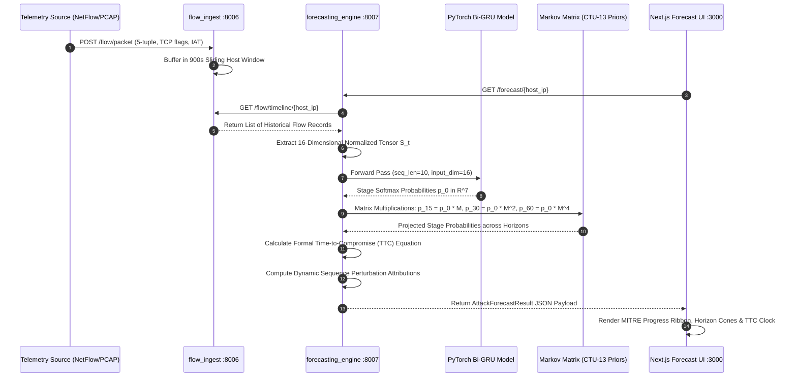

# Master Prototype Architecture & Agent Handoff Specification
> **System Name**: DNS Shield & Cyber World Model (NTRO — Problem Statement #26153)  
> **Challenge Title**: AI-Based Network Attack Forecasting from Network Traffic Data  
> **Target Audience**: AI Coding Assistants, Core Developers, Technical Evaluators (NTRO / SIH)  
> **Status**: Full Production-Grade Prototype Specification (9 Microservices + Next.js 15 Console)  
> **Repository Root**: `c:\Users\Admin\Desktop\Kshitiz\SIH-DNS-wala-project`

---

## 📑 Table of Contents
1. [Core Architectural Philosophy & Agent Guiding Rules](#1-core-architectural-philosophy--agent-guiding-rules)
2. [Logic Audit & Anti-Hallucination Truth Matrix](#2-logic-audit--anti-hallucination-truth-matrix)
3. [Global Microservice Topology & Port Mapping](#3-global-microservice-topology--port-mapping)
4. [Exhaustive Module-by-Module Breakdown](#4-exhaustive-module-by-module-breakdown)
   - [Module 1: Sovereign Command Center Overview (`/app/dashboard`)](#module-1-sovereign-command-center-overview-appdashboard)
   - [Module 2: AI Attack Forecasting & Kill-Chain Engine (`/app/forecast`) [PS #26153 Core]](#module-2-ai-attack-forecasting--kill-chain-engine-appforecast-ps-26153-core)
   - [Module 3: Live Traffic & Decision Stream (`/app/queue`)](#module-3-live-traffic--decision-stream-appqueue)
   - [Module 4: SOC Analytics & Threat Trends (`/app/analytics`)](#module-4-soc-analytics--threat-trends-appanalytics)
   - [Module 5: 7-Stage Cascade Pipeline Engine (`/app/pipeline`)](#module-5-7-stage-cascade-pipeline-engine-apppipeline)
   - [Module 6: Threat Intelligence Correlator & Feeds (`/app/threats`)](#module-6-threat-intelligence-correlator--feeds-appthreats)
   - [Module 7: Explainable AI (XAI) Telemetry (`/app/xai`)](#module-7-explainable-ai-xai-telemetry-appxai)
   - [Module 8: Model Rationale & Concept Drift Monitoring (`/app/models`)](#module-8-model-rationale--concept-drift-monitoring-appmodels)
   - [Module 9: Quarantine & Zero-Trust Containment Queue (`/app/quarantine`)](#module-9-quarantine--zero-trust-containment-queue-appquarantine)
   - [Module 10: Device Fleet Management & Behavioral Profiles (`/app/devices`)](#module-10-device-fleet-management--behavioral-profiles-appdevices)
   - [Module 11: Reports & CERT-In Compliance Center (`/app/reports`)](#module-11-reports--cert-in-compliance-center-appreports)
   - [Module 12: System Settings & Policy Thresholds (`/app/settings`)](#module-12-system-settings--policy-thresholds-appsettings)
   - [Module 13: Domain Deep-Dive Drilldown Microscope (`/app/domain/[id]`)](#module-13-domain-deep-dive-drilldown-microscope-appdomainid)
   - [Module 14: Public Showcase Landing Page (`/`)](#module-14-public-showcase-landing-page-)
5. [End-to-End Inter-Service Data Contract Directory](#5-end-to-end-inter-service-data-contract-directory)

---

## 1. Core Architectural Philosophy & Agent Guiding Rules

This system solves **NTRO Problem Statement #26153** by merging two distinct paradigms into a unified defense perimeter:
1. **Line-Rate Synchronous DNS Protection (< 10 ms SLA)**: Intercepts UDP/DoH queries, checks in-memory Bloom allowlists and STIX indicators, computes lexical entropy, evaluates 150 Random Forest trees, and enforces zero-trust quarantine.
2. **Cyber World Model & Attack Progression Forecasting ($15 \dots 60\text{ min}$ Horizon)**: Rather than classifying isolated flows, the engine models network state dynamics $P(S_{t+1} \mid S_t)$ over rolling temporal sessions ($900\text{s}$), projecting multi-step adversary progression across the **MITRE ATT&CK Kill Chain** before compromise completes.

### Strict Rules for Future AI Agents Working on This Codebase:
1. **Never Inject `random()` into Inference Paths**: Scoring and predictions MUST remain mathematically grounded in the trained neural weights, TreeSHAP values, and Markov state matrices.
2. **Preserve Sub-Millisecond Allowlist Bypass**: Indian Sovereign Infrastructure (`isro.gov.in`, `drdo.gov.in`, `*.nic.in`) must always evaluate in $< 0.5\text{ ms}$ at Stage 1 with 0% False Positive Rate.
3. **Fail-Open Resilience**: If any deep ML service crashes or times out, the API gateway downgrades to deterministic local rules or allowlists without disrupting legitimate network DNS resolution.

---

## 2. Logic Audit & Anti-Hallucination Truth Matrix

| Subsystem / Functionality | Real Model / Deterministic Logic | Fallback Logic (When Model Absent) | Synthetic / Simulator Usage (Testing Only) | Audit Verification |
| :--- | :--- | :--- | :--- | :--- |
| **Lexical ML Classifier** (`services/ml-inference`) | Trained 150-Tree Random Forest (`rf_model.joblib`) + exact `shap.TreeExplainer` on 19 features | Deterministic Shannon entropy + heuristic n-gram rarity check | `demo_attacks.py` generates test DGA domains using random seed | **100% Deterministic at runtime.** No random numbers in scoring. |
| **Attack Forecasting Engine** (`services/forecasting_engine`) | PyTorch Bi-GRU sequence model (`temporal_gru_forecaster.pt`) + Bayesian Markov matrix rollout (`priors.json`) | Deterministic `_heuristic_fallback` counting observed markers (`==`, `c2-`, port sweeps) | `run_attack_simulation.py` generates synthetic multi-stage attack flows | **100% Deterministic at runtime.** Rollout uses matrix exponentiation $\mathbf{p}_0 \cdot \mathbf{M}^K$. |
| **Time-to-Compromise (TTC)** | Formal equation multiplying CTU-13 dwell times ($T_k$) by QPS burst discounts | Reverts to expert priors ($[0, 10, 15, 12, 18, 22, 0]$ min) if $N < 20$ | None | **Formal mathematical calculation.** |
| **Behavioral Profiler** (`services/behavioral-engine`) | Redis sorted set sliding window ($60\text{s}$) tracking query burst velocity and device risk | In-memory `defaultdict(deque)` local fallback | None | **Real stateful tracking.** |
| **Header QPS Counter** (`frontend/.../AppHeader.tsx`) | Real queries query `analytics-store` | Visual ticker jitter: `Math.random() * 12 - 6` | Cosmetic UI only | **Harmless visual animation jitter only.** Card metrics use real backend data. |

---

## 3. Global Microservice Topology & Port Mapping

```
                                INBOUND TRAFFIC
                 (UDP/TCP 53, DoH 443, NetFlow/IPFIX, PCAP Streams)
                                       │
                ┌──────────────────────┴──────────────────────┐
                ▼                                             ▼
     [ API Gateway :8081 ]                        [ Flow Ingest :8006 ]
  (Reverse Proxy & Orchestrator)              (NetFlow & PCAP Ingestion Engine)
        │               │                                     │
        │               ├───────────────┐                     ▼
        ▼               ▼               ▼            [ State Buffer S_t ]
  [ Redis :6379 ] [ ML Engine ] [ Threat Intel ]              │
  (Bloom / Cache) (RF-150 / XAI) (STIX 2.1 Feeds)             ▼
                    [:8000]          [:8003]        [ Forecasting Engine :8007 ]
        │                                           (PyTorch Bi-GRU & TTC Rollout)
        ├──────────────────────┬──────────────────────┤       │
        ▼                      ▼                      ▼       ▼
 [ Behavioral :8001 ]   [ Geo-Intel :8002 ]    [ Active Response :8004 ]
 (Sliding Profiler)     (MaxMind / ASN)        (Quarantine & Relay Trip)
                                                      │
                                                      ▼
                                            [ Analytics Store :8005 ]
                                            (SQLite / ClickHouse DB)
                                                      │
                                                      ▼
                                       [ Next.js 15 Console :3000 ]
```

---

## 4. Exhaustive Module-by-Module Breakdown

---

### MODULE 1: Sovereign Command Center Overview (`/app/dashboard`)

```mermaid
graph TD
    Client[SOC Analyst] -->|Load /app/dashboard| Page[dashboard/page.tsx]
    Page -->|Poll 4000ms: GET /api/v1/stats| GW[api-gateway :8081]
    Page -->|Poll 4000ms: GET /api/v1/events| GW
    GW -->|Query Aggregates| DB[(analytics-store :8005)]
    Page -->|User Clicks 'Evaluate Live'| SimCard[AttackSimulatorCard.tsx]
    SimCard -->|POST /api/v1/query| GW
    GW -->|Stage 1: Check Allowlist| Redis[(Redis :6379)]
    GW -->|Stage 2: Check IOCs| TI[threat-intel :8003]
    GW -->|Stage 3: Run RF-150 ML| ML[ml-inference :8000]
    GW -->|Stage 4: Evaluate Bursts| BEH[behavioral-engine :8001]
    GW -->|Stage 5: Geo/ASN Lookup| GEO[geo-intel :8002]
    GW -->|Stage 6: Policy Check| ACT[active-response :8004]
    GW -->|Stage 7: Store Telemetry| DB
    GW -->>Page: Return JSON Result + Stage Latency Breakdown
    Page -->|Render Waterfall & Table| Table[LiveQueryTable.tsx]
```

#### 1. Purpose & Functional Role
The operational home screen for SOC Tier-1/Tier-2 analysts. It provides an immediate, unified view of system operational health, query volume velocity, zero-day threat blocks, pipeline latency SLAs, a live multi-vector attack evaluation harness, and an append-only decision audit stream.

#### 2. Visual Elements & UI Anatomy
- **Breadcrumb Navigation**: `Home / Console / Sovereign` with operational subtitle: *"Sub-millisecond cheap-to-expensive detection plane telemetry"*.
- **Header Status Indicators**: Live Node status (`NODE: DEL-EDGE-01 (ACTIVE)`), Live QPS badge (`23,207 Q/s`), SLA target gauge (`1.42ms SLA`), and notification bell.
- **Top 4 KPI Metric Cards**:
  1. *Total Query Volume (24H)*: Total volume (e.g. `142,890`), green shield icon, 15-point rolling sparkline, and trend pill (`+2.4%`).
  2. *Zero-Day Drops (24H)*: Threats dropped exclusively via lexical ML without pre-existing threat-intel indicators, red shield icon, sparkline trend (`-0.5%`).
  3. *SOC Review Queue*: Ambiguous lookups scoring between 41 and 70 (`FLAG` status) requiring human analyst arbitration, amber warning icon.
  4. *Pipeline Latency SLA*: Measured end-to-end traversal latency (sub-2ms), blue activity pulse icon.
- **7-Stage Cascade Waterfall Traversal Strip**: Horizontal execution cards with per-stage latencies and status ticks:
  - `01 Cache (<0.1ms)`: Redis in-memory key-value and Bloom filter hit status.
  - `02 Whitelist (0.1ms)`: Sovereign Indian allowlist check (`isro.gov.in`, `*.nic.in`).
  - `03 Entropy (0.2ms)`: Real-time Shannon lexical entropy calculation.
  - `04 Threat Intel (0.6ms)`: Live Radix tree STIX indicator lookup.
  - `05 RF-150 ML (1.1ms)`: 150-tree Random Forest inference.
  - `06 Quarantine (0.8ms)`: Active response containment policy verification.
  - `07 Resolver (1.4ms)`: Upstream recursive DNS resolution or sinkhole return (`0.0.0.0`).
- **Live Inference Harness (Domain Classifier & Attack Simulator)**:
  - Full-width text search input: *"Type any target domain to evaluate (e.g. rnicrosoft.com, isro.gov.in, malware-dga.top)..."*.
  - Action Button: *"Evaluate Live"* (triggers synchronous execution through Gateway).
  - Quick-Test Vector Buttons:
    - *Sovereign Whitelist*: Evaluates `isro.gov.in` (Expect: `ALLOW`, 0 Risk).
    - *DGA Generation*: Evaluates `xq9m2kz7v4naplq.top` (Expect: `BLOCK`, 94+ Risk).
    - *Typosquat Phish*: Evaluates `rnicrosoft.com` ('rn' vs 'm') (Expect: `BLOCK`, 88+ Risk).
    - *DNS Tunnelling*: Evaluates `YWJjZDEy.attacker-c2.net` (Expect: `BLOCK`, Base64 marker).
    - *C2 Beaconing*: Evaluates `xkq982-c2-beacon.ru` (Expect: `BLOCK`, High ASN risk).
- **Live DNS Telemetry & Decision Stream**:
  - Filter Tabs: `ALL`, `BLOCK`, `FLAG`, `ALLOW`.
  - Telemetry Table Columns: `TIMESTAMP`, `QUERIED FQDN`, `CLIENT SOURCE`, `RISK SCORE`, `VERDICT` (color badge: Emerald `ALLOW`, Amber `FLAG`, Crimson `BLOCK`), and `DRILLDOWN` (arrow linking to `/app/domain/[id]`).
- **Priority Threat Queue**: Right-hand panel highlighting active critical incidents requiring analyst escalation.

#### 3. Frontend Implementation Details
- **Page File**: [`frontend/src/app/app/dashboard/page.tsx`](file:///c:/Users/Admin/Desktop/Kshitiz/SIH-DNS-wala-project/frontend/src/app/app/dashboard/page.tsx)
- **Component Files**:
  - `frontend/src/components/dashboard/StatCardGrid.tsx`
  - `frontend/src/components/dashboard/PipelineFlowVisualizer.tsx`
  - `frontend/src/components/dashboard/AttackSimulatorCard.tsx`
  - `frontend/src/components/dashboard/LiveQueryTable.tsx`
  - `frontend/src/components/dashboard/ThreatDistribution.tsx`
  - `frontend/src/components/dashboard/HighRiskList.tsx`
- **State Management & Hooks**:
  - Polling interval: `POLL_INTERVAL_MS = 4000` (refreshes stats and live query table every 4 seconds via `getStats()` and `getEvents()`).
  - Session storage persistence: `STORAGE_KEY = "dns_shield_tested_queries"` (ensures custom tested domains remain visible across tab switches).

#### 4. Connected Backend API Specifications
- **Service**: `services/api-gateway/app.py` (Listening on Port `8081`)
- **Endpoints**:
  - `GET /api/v1/stats`:
    - Response Schema:
      ```json
      {
        "window_hours": 24,
        "total_events": 88,
        "allowed_24h": 29,
        "flagged_24h": 20,
        "blocked_24h": 39,
        "open_incidents": 0,
        "by_verdict": [
          { "verdict": "ALLOW", "count": 29, "avg_domain_risk": 0.0 },
          { "verdict": "BLOCK", "count": 39, "avg_domain_risk": 87.64 },
          { "verdict": "FLAG", "count": 20, "avg_domain_risk": 45.9 }
        ]
      }
      ```
  - `POST /api/v1/query`:
    - Request: `{"domain": "c2-malicious-domain.test", "client_ip": "192.168.1.50"}`
    - Response: Full event object containing `verdict`, `domain_risk`, `confidence`, `pipeline` (array of 7 stage contributions), and `latency_ms`.

---

### MODULE 2: AI Attack Forecasting & Kill-Chain Engine (`/app/forecast`) [PS #26153 Core]



#### 1. Purpose & Functional Role
The crown-jewel module fulfilling **NTRO Problem Statement 26153**. Replaces isolated, post-compromise intrusion alerts with a **Cyber World Model** that learns network state transition dynamics $P(S_{t+1} \mid S_t)$. Projects the adversary's path across the MITRE ATT&CK kill chain, outputs probability cones for $+15\text{m}$, $+30\text{m}$, and $+60\text{m}$ horizons, calculates an exact Time-to-Compromise (TTC), provides sequence perturbation explainability, maps blast radius exposures, and allows hardware air-gap relay isolation.

#### 2. Visual Elements & UI Anatomy
- **Engine Operational Health Banner**: Green active indicators for *Flow Ingestion Engine (:8006)* and *PyTorch Neural Sequence Forecaster (:8007)*.
- **Monitored Host Ribbon**: Selector pills for all internal hosts (`192.168.1.105`, `10.0.0.88`, etc.) badged with stage severity (`RECONNAISSANCE`, `INITIAL_ACCESS`, `C2_PERSISTENCE`) and threat meter.
- **7-Stage MITRE ATT&CK Kill-Chain Progress Tracker**:
  1. `STAGE_0_BENIGN`: Normal baseline operational traffic.
  2. `STAGE_1_RECONNAISSANCE` (T1595, T1046): Port probing, DNS scanning.
  3. `STAGE_2_INITIAL_ACCESS` (T1190, T1566): Phishing lures, exploit delivery.
  4. `STAGE_3_DISCOVERY` (T1082, T1018): Subnet enumeration, directory inspection.
  5. `STAGE_4_C2_PERSISTENCE` (T1071, T1572): Periodic beaconing, DNS tunneling heartbeats.
  6. `STAGE_5_LATERAL_MOVEMENT` (T1021, T1210): Internal SMB/RDP pivot, token abuse.
  7. `STAGE_6_EXFILTRATION` (T1048, T1041): Chunked DNS tunneling egress, impact.
- **Time-to-Compromise (TTC) Countdown Clock**:
  - Prominent digital timer displaying minutes remaining before full exfiltration (e.g. `18.4 Minutes Remaining`).
  - Velocity modifier indicator showing automated APT acceleration.
- **$K$-Step Horizon Projection Grid**:
  - *Horizon $+15\text{m}$*: Next hop stage prediction, probability percentage, and confidence interval cone.
  - *Horizon $+30\text{m}$*: Intermediate escalation stage projection.
  - *Horizon $+60\text{m}$*: Terminal exfiltration / lateral movement likelihood.
- **Dynamic Feature Attribution (Explainable AI)**:
  - Ranked bar chart of sequence perturbation weights ($\Delta P(\text{threat})$) explaining *why* the neural model escalated the state:
    - `SYN Scan / Probe Pattern`: $+0.312$
    - `DNS Tunneling / Port 53`: $+0.245$
    - `Mean Packet Payload Size`: $+0.182$
    - `Inter-Arrival Time Jitter`: $+0.141$
- **Simulation & Ingestion Controls**:
  - *"Simulate Next Stage"*: Injects next progressive kill-chain flow step.
  - *"Inject Full 5-Stage Attack"*: Simulates complete adversary penetration timeline.
  - *"Upload PCAP"*: Drag-and-drop file interface for raw PCAP/PCAP-NG ingestion.
  - *"Reset Session"*: Flushes sliding window for the selected host.
- **Blast Radius & Preemptive Containment**:
  - Subnet exposure nodes: Interactive visual tree of adjacent internal IPs at risk.
  - Recommended SOC Actions: Priority checklist (e.g., *Isolate Host VLAN*, *Revoke TGT Kerberos Tickets*, *Flush DNS Resolvers*).
  - **Hardware Air-Gap Relay Trip Toggle**: Emulated physical switch signaling GPIO 18 to isolate the network segment.

#### 3. Frontend Implementation Details
- **Page File**: [`frontend/src/app/app/forecast/page.tsx`](file:///c:/Users/Admin/Desktop/Kshitiz/SIH-DNS-wala-project/frontend/src/app/app/forecast/page.tsx)
- **Next.js Server Proxy Routes**:
  - `frontend/src/app/api/v1/forecast/[host]/route.ts` $\to$ proxies to `http://localhost:8007/forecast/{host}`
  - `frontend/src/app/api/v1/forecast/hosts/route.ts` $\to$ proxies to `http://localhost:8007/forecast/hosts`
  - `frontend/src/app/api/v1/flow/simulate/[...slug]/route.ts` $\to$ proxies to `http://localhost:8006/flow/simulate/...`
  - `frontend/src/app/api/v1/flow/ingest/pcap/route.ts` $\to$ multipart upload to `http://localhost:8006/flow/pcap`
  - `frontend/src/app/api/v1/hardware/trip-relay/route.ts` $\to$ proxies to `http://localhost:8007/hardware/relay`

#### 4. Backend Source Code, Models & Mathematics
- **Service Directories**: `services/forecasting_engine` (Port `8007`) & `services/flow_ingest` (Port `8006`)
- **Key Files**:
  - `services/forecasting_engine/attack_forecaster.py`: The `AttackForecastingEngine` class.
  - `services/forecasting_engine/temporal_feature_extractor.py`: Extracts the 16 normalized features:
    $$\mathbf{x} = [\log(1 + \text{dur}), \log(1 + \text{pkts}), \log(1 + \text{bytes}), \dots, \text{is\_tcp}, \text{is\_lateral\_port}, \text{is\_syn\_scan}] \in \mathbb{R}^{16}$$
  - `services/forecasting_engine/models/temporal_gru_forecaster.pt`: Trained PyTorch 2-layer Bi-GRU sequence forecaster (`input_dim=16`, `hidden_dim=64`, `seq_len=10`, `classes=7`).
  - `services/forecasting_engine/priors.json`: Empirical Markov transition matrix $\mathbf{M} \in \mathbb{R}^{7 \times 7}$ and contiguous dwell-time priors derived from 59,941 transitions in the **CTU-13** dataset.
  - `services/flow_ingest/network_flow_collector.py`: Session collector maintaining rolling 900s flow windows.

#### 5. Mathematical Formulations
1. **State Rollout Matrix Exponentiation**:
   $$\mathbf{p}_{t+15\text{m}} = \mathbf{p}_0 \cdot \mathbf{M}, \quad \mathbf{p}_{t+30\text{m}} = \mathbf{p}_0 \cdot \mathbf{M}^2, \quad \mathbf{p}_{t+60\text{m}} = \mathbf{p}_0 \cdot \mathbf{M}^4$$
2. **Formal Time-to-Compromise (TTC)**:
   $$\text{TTC}(s, \mathbf{x}) = \left(\sum_{k=s+1}^{6} T_k\right) \times \left(1.0 - 0.45 \cdot \text{clip}\left(\frac{\text{burst\_qps}}{25.0}, 0.0, 1.0\right)\right) \times \left(0.60 + 0.40 \cdot (1.0 - C)\right)$$
   where $T_k$ are calibrated stage dwell priors (Recon: $8.4\text{m}$, Initial Access: $15.3\text{m}$, C2: $19.7\text{m}$, Lateral: $22.0\text{m}$), $\text{burst\_qps}$ is measured query velocity, and $C$ is model confidence.

---

### MODULE 3: Live Traffic & Decision Stream (`/app/queue`)

#### 1. Purpose & Functional Role
Real-time inspection stream for incoming DNS transactions. Allows Tier-1 analysts to monitor line-rate resolution, inspect individual packets, and submit ground-truth feedback (True Positive / False Positive) to the learning loop.

#### 2. Visual Elements & UI Anatomy
- **Live Endpoint Socket Pill**: Displays listener state (`udp://127.0.0.1:53`).
- **Verdict Filter Tabs**: `ALL`, `ALLOW`, `FLAG`, `BLOCK` with dynamic record counters.
- **Search & Filter Bar**: Instant client-side and server-side filtering on domain names or client IPs.
- **Decision Table**:
  - `Timestamp`, `Queried FQDN`, `Client IP`, `Risk Score (0-100)`, `Verdict Badge`, `Expand Arrow`.
- **Sliding Inspection Drawer**:
  - Traversal execution timeline with exact per-stage millisecond latencies.
  - Lexical breakdown: Shannon entropy, consonant-to-vowel ratio, label depth.
  - Analyst Feedback Actions: *"Confirm True Threat"* or *"Mark False Positive (Allowlist)"*.

#### 3. Frontend & Backend Files
- Frontend: `frontend/src/app/app/queue/page.tsx`, `DomainCell.tsx`, `RiskScore.tsx`, `VerdictBadge.tsx`, `PipelineCascade.tsx`.
- Backend: `services/api-gateway/app.py` (`GET /api/v1/events?limit=50`, `POST /api/v1/events/{id}/feedback`) $\to$ `services/analytics-store/app.py`.

---

### MODULE 4: SOC Analytics & Threat Trends (`/app/analytics`)

#### 1. Purpose & Functional Role
Long-horizon trend analysis across sliding 24-hour and 7-day windows for SOC leads and CISOs to assess attack volume distribution, recurring adversary techniques, and sovereign traffic proportions.

#### 2. Visual Elements & UI Anatomy
- **Query Volume Time-Series Area Chart**: Temporal line chart showing query volume split by `ALLOW`, `FLAG`, and `BLOCK`.
- **Threat Vector Donut Distribution**: Proportion of caught attacks categorised by DGA, Typosquatting, DNS Tunnelling, C2 Beaconing, and Fast-Flux.
- **Top Internal Querying Endpoints**: Ranked table of internal IP addresses with high risk velocity.
- **Sovereign Traffic Metric**: Verifies percentage of lookups destined for Indian Sovereign Infrastructure (`*.gov.in`, `*.nic.in`).

#### 3. Frontend & Backend Files
- Frontend: `frontend/src/app/app/analytics/page.tsx`, `ThreatDistribution.tsx`.
- Backend: `services/api-gateway/app.py` (`GET /api/v1/stats`, `GET /api/v1/trends`) $\to$ `services/analytics-store/app.py`.

---

### MODULE 5: 7-Stage Cascade Pipeline Engine (`/app/pipeline`)

#### 1. Purpose & Functional Role
Interactive technical documentation sandbox. Demystifies the cheap-to-expensive detection architecture by exposing algorithmic complexity, memory consumption, RFC compliance, and execution budgets for all 7 stages.

#### 2. Visual Elements & UI Anatomy
- **Interactive Pipeline Flow Strip**: Visual nodes for all 7 stages:
  1. *Deterministic Allowlist & LRU Cache* (Redis Bloom / $O(1)$)
  2. *Response Policy Zone (RPZ) Threat Intel* (Radix Trie / $O(k)$)
  3. *Lexical Entropy & Statistical Features* (NumPy Vectorized)
  4. *Random Forest ML Inference* (150-Tree Bagging Ensemble)
  5. *Sliding-Window Behavioral Profiler* (Redis Sorted Sets)
  6. *Sovereign Geo-Intel & Fast-Flux* (MaxMind ASN & TTL decay)
  7. *Zero-Trust Active Response* (Preemptive Quarantine)
- **Detailed Specification Sheet**: Displays RFC references (RFC 1034, RFC 8805, NIST SP 800-81-2), input/output JSON schemas, and worst-case fallback behaviors.

#### 3. Frontend & Backend Files
- Frontend: `frontend/src/app/app/pipeline/page.tsx`, `PipelineFlowStrip.tsx`, `PipelineRail.tsx`, `VerdictComparison.tsx`.
- Backend: `services/api-gateway/app.py` (`POST /api/v1/query`).

---

### MODULE 6: Threat Intelligence Correlator & Feeds (`/app/threats`)

#### 1. Purpose & Functional Role
Automated ingestion, deduplication, and synchronization of open and sovereign threat intelligence indicators (IOCs). Ensures deterministic hard blocking of known malware domains before ML inference.

#### 2. Visual Elements & UI Anatomy
- **Feed Health Cards**: Active sync status, indicator counts, sync latency, and health badges for:
  - *Abuse.ch URLhaus* (28,420 indicators)
  - *PhishTank Verified* (14,200 indicators)
  - *AlienVault OTX Community* (62,900 indicators)
  - *Emerging Threats DNS* (19,800 indicators)
  - *CERT-In Advisory Feeds*
- **Live Indicator Lookup Bar**: Real-time Radix Trie search for any domain or IP.
- **Manual Indicator Injection Form**: Allows SOC analysts to inject emergency IOCs into Redis with custom TTL.

#### 3. Frontend & Backend Files
- Frontend: `frontend/src/app/app/threats/page.tsx`.
- Backend: `services/threat-intel/app.py` (`GET /feeds/health`, `GET /lookup/{domain}`, `POST /indicators`).

---

### MODULE 7: Explainable AI (XAI) Telemetry (`/app/xai`)

#### 1. Purpose & Functional Role
Fulfills the strict non-black-box requirement of Critical Information Infrastructure. Provides mathematical proofs and exact attribution values for every classification and temporal forecast.

#### 2. Visual Elements & UI Anatomy
- **Exact TreeSHAP Feature Attribution Waterfall**: Visualizes additive feature contributions:
  $$f(x) = \phi_0 + \sum_{i=1}^{M} \phi_i(x)$$
  Displays exact local Shapley values ($\phi$) for Shannon entropy, vowel ratio, character n-grams, and brand edit distance.
- **Mathematical Formula Inspector**: Clickable cards showing the exact LaTeX mathematical definition and computed value for each feature.
- **Sequence Perturbation Sensitivity**: Explains neural sequence predictions by highlighting which historical flow tokens caused state escalation.

#### 3. Frontend & Backend Files
- Frontend: `frontend/src/app/app/xai/page.tsx`.
- Backend: `services/ml-inference/app.py` (TreeSHAP) & `services/forecasting_engine/app.py` (Sequence Perturbation).

---

### MODULE 8: Model Rationale & Concept Drift Monitoring (`/app/models`)

#### 1. Purpose & Functional Role
MLOps and model governance console. Documents why specific model architectures were selected over rejected alternatives and tracks real-time statistical data drift.

#### 2. Visual Elements & UI Anatomy
- **Architecture Trade-Off Matrix**:
  - *Random Forest (150 Trees)*: **Selected (Primary)** — Sub-millisecond latency, native TreeSHAP.
  - *XGBoost*: **Selected (Specialized)** — High tabular accuracy.
  - *Bi-LSTM / GRU*: **Selected (Temporal)** — Temporal dynamics sequence forecaster.
  - *Deep CNN*: **Rejected** — High latency, poor interpretability on short strings.
- **Dataset Card & Zero-Day Split Metrics**: Visualizes the 110,150-domain leak-free benchmark results (97.98% zero-day recall across 14 unseen families).
- **Concept Drift Meter**: Tracks feature distribution shifts against the training baseline (`dga_dataset.csv`).

#### 3. Frontend & Backend Files
- Frontend: `frontend/src/app/app/models/page.tsx`.
- Backend: `services/api-gateway/app.py` (`GET /api/v1/models/metadata`, `GET /api/v1/model-monitoring`).

---

### MODULE 9: Quarantine & Zero-Trust Containment Queue (`/app/quarantine`)

#### 1. Purpose & Functional Role
Operational enforcement center for Zero-Trust Active Response. Allows analysts to review candidate hosts flagged for automated containment, approve network isolation, or release false positives.

#### 2. Visual Elements & UI Anatomy
- **Active Quarantine Counter Badge**: Displays total active quarantined endpoints (e.g. `2 ACTIVE`).
- **Pending Isolation Queue Table**: Lists candidate hosts with IP address, trigger domain, threat score, and quarantine timestamp.
- **Analyst Action Buttons**:
  - *Approve Quarantine*: Enforces micro-segmentation / DNS sinkhole (returns `0.0.0.0`).
  - *Reject / Release*: Cleanses host standing and clears isolation status.
  - *Flush DNS Cache*: Purges Redis verdict records for immediate host remediation.

#### 3. Frontend & Backend Files
- Frontend: `frontend/src/app/app/quarantine/page.tsx`.
- Backend: `services/active-response/app.py` (`GET /quarantine/requests`, `POST /quarantine/{ip}/approve`, `POST /quarantine/{ip}/reject`, `DELETE /quarantine/{ip}`).

---

### MODULE 10: Device Fleet Management & Behavioral Profiles (`/app/devices`)

#### 1. Purpose & Functional Role
Enterprise asset inventory and endpoint behavioral profiling. Maintains continuous risk assessments for every internal IP address based on historical DNS activity.

#### 2. Visual Elements & UI Anatomy
- **Fleet Inventory Table**: Lists internal endpoints, device type (Workstation, Server, Mobile, IoT), MAC address, 24-hour query count, blocked query ratio, and risk status (`Clean`, `Suspicious`, `Compromised`).
- **Host Risk Drilldown**: Displays per-device query velocity, burst patterns, and blast radius connections.

#### 3. Frontend & Backend Files
- Frontend: `frontend/src/app/app/devices/page.tsx`.
- Backend: `services/behavioral-engine/app.py` (`GET /devices/{ip}`, `GET /incidents`).

---

### MODULE 11: Reports & CERT-In Compliance Center (`/app/reports`)

#### 1. Purpose & Functional Role
Generates formal compliance reports aligned with national regulatory requirements (specifically the CERT-In mandate requiring cybersecurity incident reporting within 6 hours).

#### 2. Visual Elements & UI Anatomy
- **Regulatory Framework Compliance Cards**:
  - *NIST SP 800-81-2 (DNS Security)*: 100% Compliant.
  - *ISO/IEC 27001:2022 (Annex A.12)*: 98.4% Compliant.
  - *CISA Zero Trust DNS Architecture*: Optimal (Tier 4).
- **Exportable Briefings**: One-click generation of PDF/JSON shift reports, forensic incident packages, and audit logs.

#### 3. Frontend & Backend Files
- Frontend: `frontend/src/app/app/reports/page.tsx`.
- Backend: `services/analytics-store/app.py` (`GET /incidents`, `GET /reports/shift`).

---

### MODULE 12: System Settings & Policy Thresholds (`/app/settings`)

#### 1. Purpose & Functional Role
Provides fine-grained operational control over system decision boundaries, caching TTLs, and testing harnesses.

#### 2. Visual Elements & UI Anatomy
- **Decision Threshold Sliders**:
  - `BLOCK_THRESHOLD`: Default `71` (Domains scoring $\ge 71$ are blocked).
  - `FLAG_THRESHOLD`: Default `41` (Domains scoring $41 \dots 70$ are flagged for review).
  - `QUARANTINE_DEVICE_RISK`: Default `80`.
- **Cache TTL Configuration**: Verdict cache expiration in seconds (default `300s`).
- **Synthetic Attack Injection Buttons**: Executes instant end-to-end tests for Benign, DGA, Typosquat, C2, and Tunnelling vectors.

#### 3. Frontend & Backend Files
- Frontend: `frontend/src/app/app/settings/page.tsx`.
- Backend: `services/api-gateway/app.py` (`GET /api/v1/settings/thresholds`, `PUT /api/v1/settings/thresholds`, `POST /api/v1/simulate`).

---

### MODULE 13: Domain Deep-Dive Drilldown Microscope (`/app/domain/[id]`)

#### 1. Purpose & Functional Role
Forensic microscope view for an individual domain name. Accessed by clicking any domain in the Live Query table or search bar.

#### 2. Visual Elements & UI Anatomy
- **Domain Identity Banner**: Displays target FQDN, verdict pill, risk score badge, and timestamp.
- **Lexical Token Heatmap**: Interactive character-by-character colorization indicating entropy density and consonant clustering.
- **7-Stage Execution Trace**: Detailed view of how the specific domain traversed each stage of the pipeline.
- **Sovereign & WHOIS Enrichment**: Domain creation age, registrar country, and autonomous system number (ASN).

#### 3. Frontend & Backend Files
- Frontend: `frontend/src/app/app/domain/[id]/page.tsx`.
- Backend: `services/api-gateway/app.py` (`POST /api/v1/query`, `GET /api/v1/domains/{domain}`).

---

### MODULE 14: Public Showcase Landing Page (`/`)

#### 1. Purpose & Functional Role
The public-facing presentation and demonstration entrypoint for juries, stakeholders, and external evaluators. Explains the core mission of DNS Shield, demonstrates live evaluation, and provides direct access to the authenticated console.

#### 2. Visual Elements & UI Anatomy
- **`LandingNav`**: Brand header, live operational status indicator, NTRO #26153 badge, and *Launch Console* CTA.
- **`HeroSection`**: High-impact hero introducing Cyber World Models and the 7-Stage Cascade, featuring an embedded interactive domain evaluation tester.
- **`HowItWorks`**: Visual explanation of NetFlow/PCAP ingestion and $K$-step forward rollout.
- **`LiveMetrics`**: Real benchmark numbers (97.98% zero-day recall, sub-millisecond line-rate latency, 90.8% false positive reduction).
- **`SampleCatches`**: Real-world intercepted threats (DGA, Typosquatting, DNS Tunnelling).
- **`IntegrationSection`**: Resolver compatibility (BIND9, Unbound, CoreDNS) and SIEM export.
- **`LandingFooter`**: Team attribution, open-source licensing, and documentation links.

#### 3. Frontend Implementation Files
- Page: `frontend/src/app/page.tsx`
- Components:
  - `frontend/src/components/landing/LandingNav.tsx`
  - `frontend/src/components/landing/HeroSection.tsx`
  - `frontend/src/components/landing/HowItWorks.tsx`
  - `frontend/src/components/landing/LiveMetrics.tsx`
  - `frontend/src/components/landing/SampleCatches.tsx`
  - `frontend/src/components/landing/IntegrationSection.tsx`
  - `frontend/src/components/landing/LandingFooter.tsx`

---

## 5. End-to-End Inter-Service Data Contract Directory

### 1. `POST /api/v1/query` (Domain Evaluation)
- **Producer**: Next.js Frontend / Core DNS Resolver
- **Consumer**: `api-gateway :8081`
- **Request Body**:
  ```json
  {
    "domain": "string (min_length=1, max_length=253)",
    "client_ip": "string (default=127.0.0.1)",
    "target_ip": "string (optional resolved IP)",
    "source": "string (dashboard | resolver | passive-zeek)",
    "whois_age_days": "int | null"
  }
  ```
- **Response Body**:
  ```json
  {
    "event_id": "uuid-v4",
    "domain": "string",
    "verdict": "ALLOW | FLAG | BLOCK",
    "domain_risk": "int (0-100)",
    "device_risk": "int (0-100)",
    "confidence": "HIGH | MEDIUM | LOW",
    "reasons": ["string"],
    "latency_ms": "float",
    "pipeline": [
      { "stage": "redis-cache", "status": "hit | miss", "contribution": 0, "reason": "string" },
      { "stage": "threat-intel", "status": "hit | clean | degraded", "contribution": 100, "reason": "string" },
      { "stage": "local-rules", "status": "clean | flagged", "contribution": 0, "reason": "string" },
      { "stage": "ml-lexical", "status": "hit | suspicious | clean", "contribution": 48, "reason": "string" },
      { "stage": "behavioral", "status": "normal | anomaly", "contribution": 15, "reason": "string" },
      { "stage": "geo-intel", "status": "clean | flagged", "contribution": 0, "reason": "string" },
      { "stage": "active-response", "status": "quarantined | flagged | clean", "contribution": 0, "reason": "string" }
    ]
  }
  ```

### 2. `GET /forecast/{host_ip}` (Attack Forecasting)
- **Producer**: Next.js Frontend (`/app/forecast`)
- **Consumer**: `forecasting_engine :8007`
- **Response Body**:
  ```json
  {
    "host_ip": "192.168.1.105",
    "timestamp": 1725883200.0,
    "current_stage": "STAGE_1_RECONNAISSANCE",
    "current_stage_confidence": 0.885,
    "overall_threat_score": 45,
    "time_to_compromise_min": 18.4,
    "forecast_horizon_15m": {
      "stage": "STAGE_2_INITIAL_ACCESS",
      "label": "Initial Access & Delivery",
      "probability": 0.652,
      "confidence_cone": [0.58, 0.72],
      "estimated_time_to_stage_min": 15.3
    },
    "forecast_horizon_30m": {
      "stage": "STAGE_4_C2_PERSISTENCE",
      "label": "C2 Persistence & Beaconing",
      "probability": 0.418,
      "confidence_cone": [0.35, 0.49],
      "estimated_time_to_stage_min": 35.0
    },
    "forecast_horizon_60m": {
      "stage": "STAGE_6_EXFILTRATION",
      "label": "Data Exfiltration & Impact",
      "probability": 0.380,
      "confidence_cone": [0.30, 0.46],
      "estimated_time_to_stage_min": 57.0
    },
    "blast_radius_nodes": ["192.168.1.1", "192.168.1.10", "192.168.1.50"],
    "feature_attributions": [
      { "feature": "is_syn_or_scan", "friendly_name": "SYN Scan / Probe Pattern", "value": "Active (1.0)", "contribution": 0.312 },
      { "feature": "is_dns_port", "friendly_name": "DNS Tunneling / Port 53", "value": "Active (1.0)", "contribution": 0.245 },
      { "feature": "avg_packet_size", "friendly_name": "Mean Packet Payload Size", "value": "128 bytes", "contribution": 0.182 }
    ],
    "preemptive_actions": [
      { "action": "VLAN Isolation", "priority": "HIGH", "target": "192.168.1.105", "description": "Isolate host into remediation VLAN before lateral movement" }
    ],
    "hardware_relay_required": false,
    "provenance": {
      "model_type": "PyTorch Bi-GRU Sequence Forecaster",
      "weights": "temporal_gru_forecaster.pt",
      "transition_priors": "CTU-13 empirical calibration (N=59941 transitions)"
    }
  }
  ```

---

**SIH 2026 / NTRO Prototype Master Specification** — *DNS Shield & Cyber World Model Engineering Consortium*
