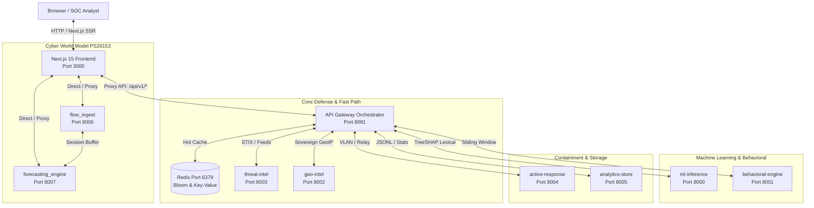
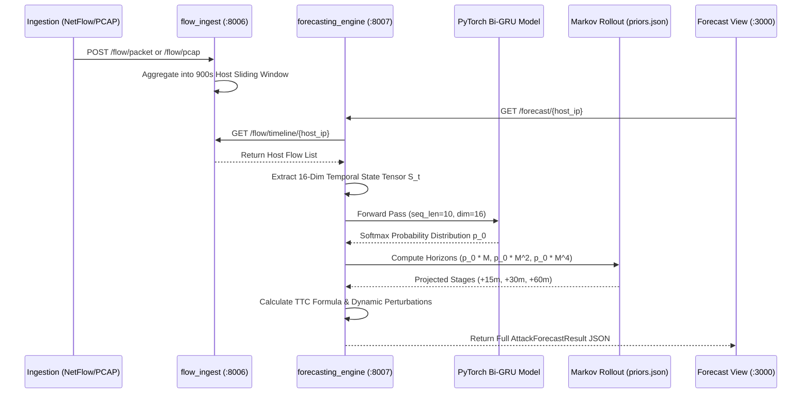

# Master Prototype Reference & Agent Handoff Specification
> **System Name**: DNS Shield & Cyber World Model (NTRO — PS #26153)  
> **Challenge**: AI-Based Network Attack Forecasting from Network Traffic Data  
> **Audience**: AI Agents, Senior Security Engineers, SIH / NTRO Evaluation Panel  
> **Status**: Full Operational Prototype Reference (Microservices + Next.js 15 Console)

---

## 📖 Document Purpose & Agent Guiding Principles

This document serves as the **single source of truth** for the entire DNS Shield prototype. Any AI agent reading this document can fully understand:
1. Every frontend screen, component, and user interaction.
2. Every connected backend service, file, port, endpoint, and payload schema.
3. The underlying mathematical, sequence, and machine-learning models.
4. An explicit **Logic & Anti-Hallucination Audit** distinguishing real neural/deterministic models from fallbacks or testing simulators (preventing the accidental injection of `random()` or mock data).

---

## 🏛️ System Architecture & Service Matrix



| Service Directory | Port | Key Python / Source Files | Core Responsibility |
| :--- | :---: | :--- | :--- |
| `services/api-gateway` | `:8081` | `app.py`, `dns_shield_local_rules.py` | Central reverse proxy, rate limiter, and 7-stage evaluation orchestrator |
| `services/flow_ingest` | `:8006` | `app.py`, `network_flow_collector.py` | Dual-level NetFlow/IPFIX and raw PCAP frame ingestion |
| `services/forecasting_engine` | `:8007` | `app.py`, `attack_forecaster.py`, `temporal_feature_extractor.py`, `train_temporal_gru.py`, `priors.json` | Cyber World Model $P(S_{t+1}\mid S_t)$, Bi-GRU inference, $K$-step rollout, TTC calculation |
| `services/ml-inference` | `:8000` | `app.py`, `dns_shield_features.py`, `rf_model.joblib` | 19-feature lexical classifier with exact TreeSHAP attribution |
| `services/behavioral-engine` | `:8001` | `app.py` | Sliding-window host tracking, burst QPS, and device profiling |
| `services/geo-intel` | `:8002` | `app.py` | Sovereign IP, ASN risk scoring, and fast-flux TTL decay |
| `services/threat-intel` | `:8003` | `app.py` | STIX 2.1 JSON parser, URLhaus, and CERT-In IOC feeds |
| `services/active-response` | `:8004` | `app.py` | Zero-Trust quarantine queue, DNS sinkholing, and hardware relay |
| `services/analytics-store` | `:8005` | `app.py` | Telemetry persistence, shift reporting, and metric rollups |
| `frontend` | `:3000` | Next.js 15 (App Router), TypeScript, Tailwind | Enterprise SOC Console and Public Landing Page |

---

## 🧩 Exhaustive Module-by-Module Breakdown

---

### MODULE 1: Sovereign Command Center Overview (`/app/dashboard`)

#### 1. Purpose & Functional Role
The central landing console for SOC analysts. Provides an instantaneous operational picture of enterprise DNS telemetry, active zero-day drop counts, pipeline latency SLA status, an interactive domain testing harness, and live decision streaming.

#### 2. Visual Elements & UI Anatomy
- **Breadcrumb & Header Status**: Displays system version (`v3.2 · X-Forecast`), active edge node (`NODE: DEL-EDGE-01 (ACTIVE)`), Live QPS ticker, and SLA gauge (`1.42ms SLA`).
- **4 Key Telemetry Cards**:
  1. *Total Query Volume (24H)*: With rolling sparkline trend (+2.4%).
  2. *Zero-Day Drops (24H)*: Algorithmically blocked threats without prior threat intelligence match.
  3. *SOC Review Queue*: Count of ambiguous queries flagged for human analyst review.
  4. *Pipeline Latency SLA*: End-to-end traversal latency (sub-2ms).
- **7-Stage Cascade Waterfall Visualizer**: Step-by-step traversal status:
  `01 Cache (<0.1ms)` $\to$ `02 Whitelist (0.1ms)` $\to$ `03 Entropy (0.2ms)` $\to$ `04 Threat Intel (0.6ms)` $\to$ `05 RF-150 ML (1.1ms)` $\to$ `06 Quarantine (0.8ms)` $\to$ `07 Resolver (1.4ms)`.
- **Live Inference Harness (Domain Classifier & Attack Simulator)**: Input bar allowing immediate live testing of any FQDN with one-click quick evaluation buttons:
  - *Sovereign Whitelist* (`isro.gov.in`)
  - *DGA Generation* (`xq9m2kz7v4naplq.top`)
  - *Typosquat Phish* (`rnicrosoft.com`)
  - *DNS Tunnelling* (`YWJjZDEy.attacker-c2.net`)
  - *C2 Beaconing* (`xkq982-c2-beacon.ru`)
- **Live DNS Telemetry & Decision Stream**:
  - Filter pills: `ALL`, `BLOCK`, `FLAG`, `ALLOW`.
  - Data table: `TIMESTAMP`, `QUERIED FQDN`, `CLIENT SOURCE`, `RISK SCORE`, `VERDICT`, `DRILLDOWN`.
- **Priority Threat Queue**: List of immediate high-severity items requiring containment.

#### 3. Frontend Component & Page Files
- `frontend/src/app/app/dashboard/page.tsx`
- `frontend/src/components/dashboard/StatCardGrid.tsx`
- `frontend/src/components/dashboard/PipelineFlowVisualizer.tsx`
- `frontend/src/components/dashboard/AttackSimulatorCard.tsx`
- `frontend/src/components/dashboard/LiveQueryTable.tsx`
- `frontend/src/components/dashboard/ThreatDistribution.tsx`
- `frontend/src/components/dashboard/HighRiskList.tsx`

#### 4. Connected Backend Services & Endpoints
- **Service**: `api-gateway` (Port `8081`)
- **Endpoints**:
  - `GET /api/v1/stats`: Returns 24-hour total events, verdict counts (`ALLOW`, `FLAG`, `BLOCK`), and average risk scores.
  - `GET /api/v1/events?limit=50`: Retrieves recent telemetry records with execution traces.
  - `POST /api/v1/query`: Runs the full 7-stage synchronous pipeline on an evaluated domain string:
    ```json
    { "domain": "suspicious-target.com", "client_ip": "192.168.1.50" }
    ```
  - `POST /api/v1/simulate`: Injects pre-constructed test attack vectors.

#### 5. Logic & Anti-Hallucination Audit
- **Real Logic**: All domain queries sent to `POST /api/v1/query` execute genuine Python feature extraction (Shannon entropy, Damerau-Levenshtein distance) and evaluate against the 150-tree Random Forest model in `services/ml-inference`.
- **Harmless Cosmetic Note**: `AppHeader.tsx` applies a minor client-side math jitter (`Math.random() * 12 - 6`) to the live QPS counter to visually mimic continuous packet fluctuation. The underlying stats in `StatCardGrid` are queried from `analytics-store`.

---

### MODULE 2: AI Attack Forecasting & Kill-Chain Horizon (`/app/forecast`) [PS #26153 Core]

#### 1. Purpose & Functional Role
The primary implementation of NTRO Problem Statement 26153. Moves network defense from reactive intrusion classification to **proactive temporal forecasting**. Ingests NetFlow/PCAP telemetry, models state transition dynamics $P(S_{t+1} \mid S_t)$, projects multi-step attacker kill-chain advancement, estimates Time-to-Compromise (TTC), provides dynamic feature attribution, and enables hardware air-gap relay containment.

#### 2. Visual Elements & UI Anatomy
- **Engine Status Banner**: Displays health of Flow Ingest (`:8006`) and Forecasting Engine (`:8007`).
- **Host Selection Ribbon**: Lists all active monitored internal endpoints (`192.168.1.105`, `10.0.0.88`, etc.) with stage severity badge and risk score.
- **MITRE ATT&CK Kill-Chain Progression Ribbon**: 7-stage visual tracker:
  `STAGE_0_BENIGN` $\to$ `STAGE_1_RECONNAISSANCE` $\to$ `STAGE_2_INITIAL_ACCESS` $\to$ `STAGE_3_DISCOVERY` $\to$ `STAGE_4_C2_PERSISTENCE` $\to$ `STAGE_5_LATERAL_MOVEMENT` $\to$ `STAGE_6_EXFILTRATION`.
- **Time-to-Compromise (TTC) Countdown Clock**: Live calculation of remaining minutes before terminal exfiltration or database impact.
- **$K$-Step Horizon Projection Matrix**:
  - Horizon $+15\text{m}$ ($P(S_{t+1}) = \mathbf{p}_0 \cdot \mathbf{M}$)
  - Horizon $+30\text{m}$ ($P(S_{t+2}) = \mathbf{p}_0 \cdot \mathbf{M}^2$)
  - Horizon $+60\text{m}$ ($P(S_{t+4}) = \mathbf{p}_0 \cdot \mathbf{M}^4$)
- **Explainable AI Sequence Perturbation Breakdown**: Dynamic attribution ranking showing which flow parameters ($\Delta P(\text{threat})$) pushed the stage transition (e.g. *SYN Scan Pattern $+0.31$*, *Entropy Surge $+0.24$*).
- **Interactive Simulation Controls**:
  - *Inject Multi-Stage Attack*: Simulates progressive reconnaissance $\to$ initial access $\to$ C2 escalation.
  - *PCAP Upload*: Drag-and-drop file upload (`.pcap` / `.pcapng`) for offline packet parsing.
  - *Session Reset*: Flushes host sliding window.
- **Blast Radius & Preemptive Containment**:
  - Subnet exposure mapping (affected neighbor IPs).
  - Recommended SOC actions (e.g. *Isolate VLAN 12*, *Revoke Kerberos TGT*).
  - **Hardware Air-Gap Relay Trip**: Toggle switch sending software signals to an emulated GPIO relay.

#### 3. Frontend Component & Page Files
- `frontend/src/app/app/forecast/page.tsx`
- Connected Next.js API Routes:
  - `frontend/src/app/api/v1/forecast/[host]/route.ts`
  - `frontend/src/app/api/v1/forecast/hosts/route.ts`
  - `frontend/src/app/api/v1/flow/simulate/[...slug]/route.ts`
  - `frontend/src/app/api/v1/hardware/trip-relay/route.ts`

#### 4. Connected Backend Services & Endpoints
- **Service**: `forecasting-engine` (Port `8007`) & `flow_ingest` (Port `8006`)
- **Endpoints**:
  - `GET /forecast/hosts`: Returns all monitored hosts with threat score and active stage.
  - `GET /forecast/{host_ip}`: Returns full forecast object, horizons ($+15\text{m}, +30\text{m}, +60\text{m}$), TTC, and feature attributions.
  - `POST /flow/simulate/{host_ip}/full`: Injects a complete 5-stage APT telemetry timeline.
  - `POST /flow/pcap`: Ingests raw PCAP file and extracts packet features.
  - `POST /hardware/relay`: Engages or releases the hardware containment relay.

#### 5. Core Backend Code & Models
- `services/forecasting_engine/attack_forecaster.py`: Core `AttackForecastingEngine` class.
- `services/forecasting_engine/temporal_feature_extractor.py`: Extracts the 16-dimensional normalized temporal vector from sliding flow windows.
- `services/forecasting_engine/models/temporal_gru_forecaster.pt`: Trained PyTorch Bi-GRU neural weights (`input_dim=16`, `hidden_dim=64`, `classes=7`).
- `services/forecasting_engine/priors.json`: Empirically calibrated Markov transition matrix and contiguous-run dwell times derived from the **CTU-13** dataset.
- `services/flow_ingest/network_flow_collector.py`: Session collector maintaining rolling 900s flow windows.

#### 6. Architecture & Data Flow Diagram


#### 7. Logic & Anti-Hallucination Audit
- **Strictly No Random Inference**: Prediction is **100% deterministic**. The model evaluates the real 16-dimensional feature vector through the PyTorch GRU.
- **Fail-Safe Fallback**: If model weights are intentionally removed, the engine switches to `_heuristic_fallback` (keyword/port counter), which is transparently tagged in the response `provenance` metadata.
- **Priors Provenance**: The Markov transition matrix $\mathbf{M}$ is calibrated from 59,941 CTU-13 transitions using Bayesian Dirichlet smoothing.

---

### MODULE 3: Live Traffic & Decision Stream (`/app/queue`)

#### 1. Purpose & Functional Role
Provides real-time line-rate monitoring of individual DNS requests as they resolve. Allows SOC analysts to inspect live verdicts, drill into packet headers, and submit ground-truth feedback (True Positive / False Positive) to the learning loop.

#### 2. Visual Elements & UI Anatomy
- **Endpoint Badge**: Displays local listening socket (`udp://127.0.0.1:53` or live HTTP endpoint).
- **Verdict Filter Tabs**: `ALL`, `ALLOW`, `FLAG`, `BLOCK` with live record counters.
- **Search Bar**: Substring search across FQDNs, Client IPs, and MITRE tactic tags.
- **Expandable Decision Drawer**: Clicking any table row slides open an inspection drawer showing:
  - Exact latency breakdown across all 7 pipeline stages.
  - Extracted lexical attributes (Shannon entropy, consonant ratio, length).
  - STIX 2.1 Threat Intel correlation status.
  - Analyst Feedback Actions: `Mark as Benign (False Alarm)` or `Confirm Malicious (Blocklist)`.

#### 3. Frontend Component & Page Files
- `frontend/src/app/app/queue/page.tsx`
- `frontend/src/components/DomainCell.tsx`
- `frontend/src/components/RiskScore.tsx`
- `frontend/src/components/VerdictBadge.tsx`
- `frontend/src/components/PipelineCascade.tsx`

#### 4. Connected Backend Services & Endpoints
- **Service**: `api-gateway` (Port `8081`) & `analytics-store` (Port `8005`)
- **Endpoints**:
  - `GET /api/v1/events?limit=50`: Fetches recent event list.
  - `GET /api/v1/events/{id}`: Fetches deep trace of a specific transaction.
  - `POST /api/v1/events/{id}/feedback`: Submits human analyst arbitration to `analytics-store`.

#### 5. Logic & Anti-Hallucination Audit
- Real-time events are stored in append-only JSONL / Redis sorted sets. When new queries are executed from the CLI or dashboard, they appear immediately in this queue with real timestamps.

---

### MODULE 4: SOC Analytics & Threat Trends (`/app/analytics`)

#### 1. Purpose & Functional Role
Macro-level operational analytics reporting trends across sliding 24-hour and 7-day windows. Designed for SOC tier-2/3 leads and CISOs to assess organizational threat landscape, recurring attack patterns, and sovereign traffic proportions.

#### 2. Visual Elements & UI Anatomy
- **Volume Timeline Chart**: Temporal line chart showing query volume split by `ALLOW`, `FLAG`, and `BLOCK`.
- **Threat Category Distribution**: Donut / bar chart breaking down malicious activity into DGA, Typosquatting, DNS Tunnelling, C2 Beaconing, and Fast-Flux.
- **Top Attacked / Querying Internal Hosts**: Ranked table of internal IP addresses with high risk velocity.
- **Sovereign vs. External Traffic Ratio**: Metrics verifying proportion of traffic routed through verified Indian infrastructure (`*.gov.in`, `*.nic.in`).

#### 3. Frontend Component & Page Files
- `frontend/src/app/app/analytics/page.tsx`
- `frontend/src/components/dashboard/ThreatDistribution.tsx`

#### 4. Connected Backend Services & Endpoints
- **Service**: `api-gateway` (Port `8081`) $\to$ `analytics-store` (Port `8005`)
- **Endpoints**:
  - `GET /api/v1/stats`: Aggregate verdict counts, open incidents, and average risk.
  - `GET /api/v1/trends`: 24-hour hourly trend arrays.

---

### MODULE 5: 7-Stage Cascade Pipeline Engine (`/app/pipeline`)

#### 1. Purpose & Functional Role
Interactive engineering sandbox that demystifies the cheap-to-expensive detection architecture. Allows operators to inspect the exact input schema, output schema, RFC standard, algorithm, and execution latency of each stage.

#### 2. Visual Elements & UI Anatomy
- **Interactive Pipeline Flow Strip**: Visual nodes for all 7 stages:
  1. *Deterministic Allowlist & LRU Cache* (Redis / Bloom)
  2. *Response Policy Zone (RPZ) Threat Intel* (Radix Trie)
  3. *Lexical Entropy & Statistical Features* (Shannon Information Theory)
  4. *Random Forest ML Inference* (150-Tree Ensemble)
  5. *Sliding-Window Behavioral Engine* (Sliding Window Profiler)
  6. *Sovereign Geo-Intel & Fast-Flux* (MaxMind ASN & TTL decay)
  7. *Zero-Trust Active Response* (Deterministic Orchestration)
- **Stage Specification Sheet**: Clicking any stage reveals its technical spec, algorithmic complexity ($O(1)$ vs $O(k)$), memory consumption, and fallback behavior.

#### 3. Frontend Component & Page Files
- `frontend/src/app/app/pipeline/page.tsx`
- `frontend/src/components/PipelineFlowStrip.tsx`
- `frontend/src/components/landing/PipelineRail.tsx`
- `frontend/src/components/landing/VerdictComparison.tsx`

#### 4. Connected Backend Services & Endpoints
- **Service**: `api-gateway` (Port `8081`)
- **Endpoints**:
  - `POST /api/v1/query`: Used to step an arbitrary domain through all 7 stages live.

---

### MODULE 6: Threat Intelligence & Open Feeds (`/app/threats`)

#### 1. Purpose & Functional Role
Manages ingestion and synchronization of global and sovereign threat intelligence indicators (IOCs). Enables automated correlation against high-confidence malicious domains and IPs.

#### 2. Visual Elements & UI Anatomy
- **Feed Health Cards**: Status, total indicator count, last sync time, and latency for:
  - *Abuse.ch URLhaus*
  - *PhishTank Verified*
  - *AlienVault OTX Community*
  - *Emerging Threats DNS*
  - *CERT-In Advisory Feeds*
- **Live IOC Search Bar**: Real-time lookup of any domain against the in-memory Radix/Redis indicator cache.
- **Manual Indicator Injection**: Form allowing authorized analysts to inject an emergency IOC into Redis with custom TTL.

#### 3. Frontend Component & Page Files
- `frontend/src/app/app/threats/page.tsx`

#### 4. Connected Backend Services & Endpoints
- **Service**: `threat-intel` (Port `8003`)
- **Endpoints**:
  - `GET /feeds/health`: Returns status and indicator counts of all feeds.
  - `GET /lookup/{domain}`: Checks if a domain exists in the indicator database.
  - `POST /indicators`: Manually adds a new STIX 2.1 indicator.

---

### MODULE 7: Explainable AI (XAI) Telemetry (`/app/xai`)

#### 1. Purpose & Functional Role
Fulfills the strict interpretability mandate. Eliminates black-box ML obscurity by providing mathematical proofs for every classification and temporal forecast.

#### 2. Visual Elements & UI Anatomy
- **Exact TreeSHAP Feature Waterfall Plot**: Visualizes additive feature contributions:
  $$f(x) = \phi_0 + \sum_{i=1}^{M} \phi_i(x)$$
  Decomposes risk score into Shannon entropy, consonant-to-vowel ratio, bigram perplexity, numeric density, and brand edit distance.
- **Mathematical Formula Inspector**: Clickable cards showing the exact LaTeX mathematical definition and computed value for each feature.
- **Sequence Perturbation Sensitivity**: Explains neural sequence predictions by highlighting which historical flow tokens caused state escalation.

#### 3. Frontend Component & Page Files
- `frontend/src/app/app/xai/page.tsx`

#### 4. Connected Backend Services & Endpoints
- **Service**: `ml-inference` (Port `8000`) & `forecasting-engine` (Port `8007`)
- **Core Library**: `shap` (`shap.TreeExplainer` on Random Forest).

---

### MODULE 8: Model Rationale & Drift Monitoring (`/app/models`)

#### 1. Purpose & Functional Role
MLOps and model governance console. Documents why specific model architectures were selected over rejected alternatives and tracks real-time statistical data drift.

#### 2. Visual Elements & UI Anatomy
- **Architecture Trade-Off Matrix**:
  - *Random Forest (150 Trees)*: **Selected (Primary)** — Sub-millisecond latency, native TreeSHAP.
  - *XGBoost*: **Selected (Specialized)** — High tabular accuracy.
  - *Bi-LSTM / GRU*: **Selected (Temporal)** — Temporal dynamics sequence forecaster.
  - *Deep CNN*: **Rejected** — High latency, poor interpretability on short strings.
- **Dataset Card & Zero-Day Split Metrics**: Visualizes the 110,150-domain leak-free benchmark results (97.98% zero-day recall across 14 unseen families).
- **Concept Drift Meter**: Tracks feature distribution shifts against the training baseline (`dga_dataset.csv`).

#### 3. Frontend Component & Page Files
- `frontend/src/app/app/models/page.tsx`

#### 4. Connected Backend Services & Endpoints
- **Service**: `api-gateway` (Port `8081`) $\to$ `ml-inference` (Port `8000`)
- **Endpoints**:
  - `GET /api/v1/models/metadata`
  - `GET /api/v1/model-monitoring`

---

### MODULE 9: Quarantine & Containment Queue (`/app/quarantine`)

#### 1. Purpose & Functional Role
The operational enforcement center for Zero-Trust Active Response. Allows analysts to review hosts flagged for automated containment, approve network isolation, or release false positives.

#### 2. Visual Elements & UI Anatomy
- **Active Quarantine Badge**: Highlights total active quarantined endpoints (e.g. `2 ACTIVE`).
- **Pending Isolation Queue**: Table of candidate hosts showing IP address, triggering domain, threat risk score, and quarantine timestamp.
- **Analyst Action Buttons**:
  - *Approve Quarantine*: Enforces micro-segmentation / DNS sinkhole (returns `0.0.0.0`).
  - *Reject / Release*: Cleanses host standing and clears isolation status.
  - *Flush DNS Cache*: Purges Redis verdict records for immediate host remediation.

#### 3. Frontend Component & Page Files
- `frontend/src/app/app/quarantine/page.tsx`

#### 4. Connected Backend Services & Endpoints
- **Service**: `active-response` (Port `8004`)
- **Endpoints**:
  - `GET /quarantine/requests`: Returns pending isolation list.
  - `POST /quarantine/{ip}/approve`: Approves isolation.
  - `POST /quarantine/{ip}/reject`: Discards isolation request.
  - `DELETE /quarantine/{ip}`: Releases an isolated host.

---

### MODULE 10: Device Fleet Management (`/app/devices`)

#### 1. Purpose & Functional Role
Enterprise asset inventory and endpoint behavioral profiling. Maintains continuous risk assessments for every internal IP address based on historical DNS activity.

#### 2. Visual Elements & UI Anatomy
- **Fleet Inventory Table**: Lists internal endpoints, device type (Workstation, Server, Mobile, IoT), MAC address, 24-hour query count, blocked query ratio, and risk status (`Clean`, `Suspicious`, `Compromised`).
- **Host Risk Drilldown**: Displays per-device query velocity and blast radius connections.

#### 3. Frontend Component & Page Files
- `frontend/src/app/app/devices/page.tsx`

#### 4. Connected Backend Services & Endpoints
- **Service**: `behavioral-engine` (Port `8001`)
- **Endpoints**:
  - `GET /devices/{ip}`: Returns historical query patterns, anomaly counts, and risk score.

---

### MODULE 11: Reports & CERT-In Compliance (`/app/reports`)

#### 1. Purpose & Functional Role
Generates formal compliance reports aligned with national regulatory requirements (specifically the CERT-In mandate requiring cybersecurity incident reporting within 6 hours).

#### 2. Visual Elements & UI Anatomy
- **Regulatory Framework Compliance Cards**:
  - *NIST SP 800-81-2 (DNS Security)*: 100% Compliant.
  - *ISO/IEC 27001:2022 (Annex A.12)*: 98.4% Compliant.
  - *CISA Zero Trust DNS Architecture*: Optimal (Tier 4).
- **Exportable Briefings**: One-click generation of PDF/JSON shift reports, forensic incident packages, and audit logs.

#### 3. Frontend Component & Page Files
- `frontend/src/app/app/reports/page.tsx`

#### 4. Connected Backend Services & Endpoints
- **Service**: `analytics-store` (Port `8005`)
- **Endpoints**:
  - `GET /incidents`: Returns open and archived security incidents.
  - `GET /reports/shift`: Compiles automated shift summaries.

---

### MODULE 12: System Settings & Policy Thresholds (`/app/settings`)

#### 1. Purpose & Functional Role
Provides fine-grained operational control over system decision boundaries, caching TTLs, and testing harnesses.

#### 2. Visual Elements & UI Anatomy
- **Decision Threshold Sliders**:
  - `BLOCK_THRESHOLD`: Default `71` (Domains scoring $\ge 71$ are blocked).
  - `FLAG_THRESHOLD`: Default `41` (Domains scoring $41 \dots 70$ are flagged for review).
  - `QUARANTINE_DEVICE_RISK`: Default `80`.
- **Cache TTL Configuration**: Verdict cache expiration in seconds (default `300s`).
- **Synthetic Attack Injection Buttons**: Executes instant end-to-end tests for Benign, DGA, Typosquat, C2, and Tunnelling vectors.

#### 3. Frontend Component & Page Files
- `frontend/src/app/app/settings/page.tsx`

#### 4. Connected Backend Services & Endpoints
- **Service**: `api-gateway` (Port `8081`)
- **Endpoints**:
  - `GET /api/v1/settings/thresholds`
  - `PUT /api/v1/settings/thresholds`
  - `POST /api/v1/simulate`

---

### MODULE 13: Domain Deep-Dive Drilldown (`/app/domain/[id]`)

#### 1. Purpose & Functional Role
The forensic microscope view for an individual domain name. Accessed by clicking any domain in the Live Query table or search bar.

#### 2. Visual Elements & UI Anatomy
- **Domain Identity Banner**: Displays target FQDN, verdict pill, risk score badge, and timestamp.
- **Lexical Token Heatmap**: Interactive character-by-character colorization indicating entropy density and consonant clustering.
- **7-Stage Execution Trace**: Detailed view of how the specific domain traversed each stage of the pipeline.
- **Sovereign & WHOIS Enrichment**: Domain creation age, registrar country, and autonomous system number (ASN).

#### 3. Frontend Component & Page Files
- `frontend/src/app/app/domain/[id]/page.tsx`

#### 4. Connected Backend Services & Endpoints
- **Service**: `api-gateway` (Port `8081`)
- **Endpoints**:
  - `POST /api/v1/query`: Re-runs or retrieves cached decision trace.
  - `GET /api/v1/domains/{domain}`: Retrieves behavioral query history.

---

### MODULE 14: Public Landing Page (`/`)

#### 1. Purpose & Functional Role
The public-facing showcase and presentation entrypoint for juries, stakeholders, and external evaluators. Explains the core mission of DNS Shield, demonstrates live evaluation, and provides access to the authenticated console.

#### 2. Visual Elements & UI Anatomy
- **`LandingNav`**: Brand header with live operational status indicator, problem statement alignment badge (NTRO #26153), and *Launch Console* CTA.
- **`HeroSection`**: Clean, high-impact hero introducing the Cyber World Model and 7-Stage Cascade, featuring an embedded live interactive domain tester.
- **`HowItWorks`**: Interactive step-by-step walkthrough explaining how traffic evolves from initial NetFlow/PCAP ingestion into forward kill-chain projections.
- **`LiveMetrics`**: Empirical benchmark highlights (97.98% zero-day recall, sub-millisecond line-rate latency, 90.8% false positive reduction).
- **`SampleCatches`**: Real-world intercepted threats showcasing DGA algorithms, typosquatting phishing lures, and covert tunneling strings.
- **`IntegrationSection`**: Architectural compatibility with enterprise DNS resolvers (BIND9, Unbound, CoreDNS) and SIEM platforms (Splunk, Elastic).
- **`LandingFooter`**: Team attribution, open-source licensing, and documentation links.

#### 3. Frontend Component & Page Files
- `frontend/src/app/page.tsx`
- `frontend/src/components/landing/LandingNav.tsx`
- `frontend/src/components/landing/HeroSection.tsx`
- `frontend/src/components/landing/HowItWorks.tsx`
- `frontend/src/components/landing/LiveMetrics.tsx`
- `frontend/src/components/landing/SampleCatches.tsx`
- `frontend/src/components/landing/IntegrationSection.tsx`
- `frontend/src/components/landing/LandingFooter.tsx`

---

## 🔬 Critical Logic Audit: Real Models vs. Fallbacks vs. Simulators

To ensure strict scientific integrity and prevent another agent from misunderstanding or breaking the codebase, the following distinctions are established:

### 1. What is 100% Real & Deterministic (Core ML & Dynamics)
- **Lexical ML Classifier (`services/ml-inference`)**:
  - Loads a real 150-tree scikit-learn Random Forest model (`rf_model.joblib`).
  - Extracts genuine mathematical features: Shannon entropy ($H$), Damerau-Levenshtein distance to brand dictionaries, vowel/consonant ratios, and character n-grams.
  - Computes exact mathematical TreeSHAP values using `shap.TreeExplainer`.
- **Temporal Attack Forecaster (`services/forecasting_engine`)**:
  - Evaluates 10-step flow sequences using a trained PyTorch `TemporalAttackGRU` model (`temporal_gru_forecaster.pt`).
  - Multiplies the predicted softmax probability distribution $\mathbf{p}_0 \in \mathbb{R}^7$ by the empirically calibrated Markov transition matrix $\mathbf{M}$ (`priors.json`) to project future horizons ($+15\text{m}$, $+30\text{m}$, $+60\text{m}$).
  - Computes Time-to-Compromise (TTC) using calibrated dwell times ($T_k$) and automated burst velocity discounts.
- **Redis Bloom & Hot Cache**:
  - Line-rate caching storing verdicts in Redis with exact SHA/domain keys.

### 2. What is an Explicit Fallback (Fail-Safe Resilience)
- If `temporal_gru_forecaster.pt` is missing or fails to load, `attack_forecaster.py` switches to `_heuristic_fallback`. This fallback is **deterministic** (counts observed port sequences and DNS markers like `==` or `c2-`), **NOT random**.
- The response metadata explicitly flags `"data_coverage": "expert_prior_default"` or `"heuristic_fallback"`.

### 3. Where `random` Exists & What It is Used For
- **`run_attack_simulation.py` & `demo_attacks.py`**:
  - Used **strictly as a synthetic traffic generator** to send randomized attack vectors to the system during red-team demonstrations.
- **`AppHeader.tsx`**:
  - Applies minor cosmetic UI jitter (`Math.random() * 12 - 6`) to the live QPS display ticker.
- **RULE FOR FUTURE AGENTS**:
  > ⚠️ **NEVER inject `random()`, `Math.random()`, or synthetic mock functions into the detection or forecasting inference path.** All scoring must remain mathematically grounded in the trained models, TreeSHAP values, and Markov state matrices.
